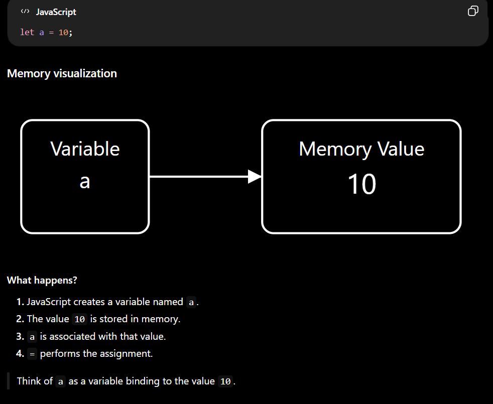
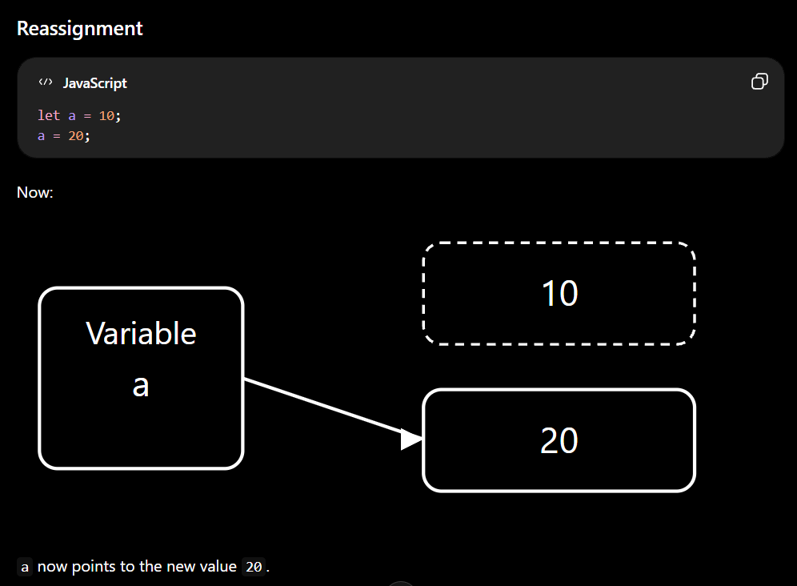

Operator in js
---------------
- An operator is a symbol or keyword that tells JavaScript to perform a specific operation on one or more operands
- Operators can be unary, binary, or ternary depending on the number of operands they operate on.”
```js
let a = 10 + 20;
```
- expression = "10 + 20" (Expression produce a value)
- Example :<>
```js
10 + 20
x > 10
user?.name
condition ? "yes" : "no"
```
- operand = "10,20"
- operator = "+"    


Types :
--------

1. Arithmetic Operators 
---------------------
- Used for mathematical operations.

| Operator | Meaning        |
| -------- | -------------- |
| `+`      | Addition       |
| `-`      | Subtraction    |
| `*`      | Multiplication |
| `/`      | Division       |
| `%`      | Remainder      |
| `**`     | Exponentiation |

- `%` : Give remainder after division
- `**`: `2 ** 3 = 2³ = 2 × 2 × 2 = 8` → `a ** b = aᵇ` → a raised to the power of b.

2. Assignment Operators 
------------------------
- An operator that assigns a value or expression result to a variable.
- The basic assignment operator is =, and JavaScript also provides compound assignment operators like +=, -=, *=, /=, %=, and `=` that perform an operation and then assign the result back to the same variable.**
- Logical Assignment Operators (ES2021) = (&&=,||=,??=)

a. How assignment works in memory
-------------------------------
- The variable is binding with value




b. Compound Assignment Operators
---------------------------------
- These operators combine an operation with assignment.

| Operator | Equivalent To |
| -------- | ------------- |
| `+=`     | `a = a + b`   |
| `-=`     | `a = a - b`   |
| `*=`     | `a = a * b`   |
| `/=`     | `a = a / b`   |
| `%=`     | `a = a % b`   |
| `**=`    | `a = a ** b`  |

```js
let a=1;
let b=2;
console.log(a+=b);  // a=a+b = 3
console.log(a-=b); // a=a-b = 3 - 2 = 1
console.log(a*=b); // a=a*b = 1*2 = 2 
console.log(a/=b); // a=a/b = 2/2 = 1
console.log(a%=b); // a=a%b = 1%2 = 1
console.log(a**=b); // a=a**b = 1**2 = 1^2 = 1
```

3. Comparison Operators
-------------------------
- Comparison operators compare values and return a boolean.
```js
>    greater than
<    less than
>=   greater than or equal
<=   less than or equal
==   loose equality
!=   loose inequality
===  strict equality
!==  strict inequality
```
- Same idea also for (!=)(loose inequality) and (!==)(strict inequality)

```js
// # Loose Equality
// # JavaScript may perform type coercion before comparing. 
console.log(5 == '5')  // (5 == '5') = type coercion = (5 == 5) = true
// # Strict Equality
console.log(5 === '5') // false (value is same but DT is diff)
// # Loose Inquality
console.log(5 != '5'); // (5 != '5') = (5 != 5)= false (cuase they are equal)
// # Strict Equality
console.log(5 !== '5') // true (vaue is not same)(cuase DT is different)
```
# Note : In fact, NaN is not equal to itself:
- `NaN` stands for `Not-a-Number`. 
- In JavaScript, `NaN` is a special numeric value that `represents` an `unrepresentable or invalid or undefined numeric result`. 
- `NaN` is `never equal to itself`, so both `NaN == NaN` and `NaN === NaN` return `false`. 
- This behavior comes from the `IEEE-754 floating-point standard`. To check whether a value is NaN, we use `Number.isNaN()`.
```js
console.log(NaN == NaN);            // false
console.log(NaN === NaN);           // false
console.lopg(typeof NaN);           // number
console.log(Number.isNaN(NaN));     // true
```

4. Logical Operators
----------------------
1. AND && = Both conditions must be truthy.
2. OR || = At least one conditon must be truthy.
3. ! = Flips the boolean value (!true = false)

```js
let loggedIn = false;

if (!loggedIn) {
    console.log("Please login");
}
```

- && and || used in Short-Circuiting Logic
- && returns the first falsy value; if there is no falsy value, it returns the last value.

```js
0 && 10        // 0
"" && "Hello"  // ""
null && 10     // null

10 && 20       // 20
"Hi" && 100    // 100
```
- Note : if condition internally converting truthy and falsy value to boolean to validate
```js
console.log(10 && 20)          // 20
console.log("rahul" && 20)     // 20
console.log([] && 20)          // 20
console.log({} && 20)          // 20
// # Falsy value
console.log(0 && 20)           // 0
console.log("" && 20)          // 
console.log(null && 20)        // null
console.log(undefined && 20)   // undefined
console.log(NaN && 20)         // NaN

console.log("---------------------------------------")

console.log(Boolean(10 && 20))          // true
console.log(Boolean("rahul" && 20))     // true
console.log(Boolean([] && 20))          // true
console.log(Boolean({} && 20))          // true
// # Falsy value
console.log(Boolean(0 && 20))           // false
console.log(Boolean("" && 20))          // false
console.log(Boolean(null && 20))        // false
console.log(Boolean(undefined && 20))   // false
console.log(Boolean(NaN && 20))         // false

console.log("---------------------------------------")

if(10 && 20)                    // 10 && 20 = 20 = Boolean(20) = true
{
    console.log(true)           // true 
}
```

- || returns the first truthy value; if there is no truthy value, it returns the last value.

```js
0 || 10          // 10
"" || "Hello"    // "Hello"
null || 100      // 100

10 || 20         // 10
"Hi" || "Hello"  // "Hi"

```
```js
console.log(10 || 20)          // 10
console.log("rahul" || 20)     // rahul
console.log([] || 20)          // []
console.log({} || 20)          // {}
// # Falsy value
console.log(0 || 20)           // 20
console.log("" || 20)          // 20
console.log(null || 20)        // 20
console.log(undefined || 20)   // 20
console.log(NaN || 20)         // 20

console.log("---------------------------------------")

console.log(Boolean(10 || 20))          // true
console.log(Boolean("rahul" || 20))     // true
console.log(Boolean([] || 20))          // true
console.log(Boolean({} || 20))          // true
// # Falsy value
console.log(Boolean(0 || 20))           // true
console.log(Boolean("" || 20))          // true
console.log(Boolean(null || 20))        // true
console.log(Boolean(undefined || 20))   // true
console.log(Boolean(NaN || 20))         // true
```
- Logical Not `!`
```js
console.log(!10);        // !Boolean(10) = !true = false
console.log(!"rahul");   // !Boolean("rahul") = !true = false
console.log(![]);        // !Boolean([]) = !true = false
console.log(!{});        // !Boolean({}}) = !true = false           
console.log(!0);         // !Boolean(0) = !false = true
console.log(!"");        // !Boolean("") = !false = true
console.log(!null);      // !Boolean(null) = !false = true
console.log(!undefined); // !Boolean(undefined) = !false = true
console.log(!NaN);       // !Boolean(NaN) = !false = true
```

5. Nullish Coalescing ??
---------------------------
- This operator is similar to ||, but importantly different
- left ?? right = returns the right side only when the left side is:null/undefined

```js
let username = null/undefined;
console.log(username ?? "Guest")  // Guest


let username = "";
console.log(username ?? "Guest") // ""
console.log(username || "Guest")// Guest 
```
- Note :
- || = "Give me a fallback if the value is falsy (false)"
- ?? = "Give me a fallback only if the value is missing(nullish value)(null/undefined)"

```js
console.log(null || "Guest");
console.log(undefined || "Guest");
console.log("" || "Guest");
console.log("----------------------")
console.log(null ?? "Guest");
console.log(undefined ?? "Guest");
console.log("" ?? "Guest");

// Case 1 : if age is 0, then always 18 will assign but in real life age=0 is possible
const age = 0;
const userAge = age || 18; // not valid used of || cause age with zero is valid value
console.log(userAge); // 18 ❌ 

// Solution : used ??
const userAge = age ?? 18;
console.log(userAge); // 0 ✅

// Case 2 : volume=0
const volume = 0;
const finalVolume = volume || 50;
console.log(finalVolume); // 50 ❌ // not valid used of || cause volume with zero is valid value

// Solution : used ??
const finalVolume = volume ?? 50;
console.log(finalVolume); // 0 ✅
```

6. Unary Operators
--------------------
- A operator that performs an operation on a single operand is called UO.
- Ex: ~,!,+,-,++,--,typeof,delete,void
- For example, in typeof x, typeof is the unary operator and x is its single operand.

1. Unary `+`
-------------
- this operator used to convert value into number. 
- The unary + operator performs `numeric coercion`. For objects, JavaScript first tries to convert the object into a primitive value, and then converts that primitive to a number.

```js
Non-Primitive
  ↓
ToPrimitive
  ↓
Primitive value
  ↓
ToNumber
  ↓
Number / NaN

// # Object
+{} = js need primitive value so convert = String({}) = "[object Object]" (Primitive Value) = Number("[object Object]") = NaN
+{} = Number(String({})) = Number("[object Object]") = NaN
//- {} → memory address → convert address to number → NaN (than why array give 0 for that read below)

// # Array
// - Arrays have special string conversion behavior.
// String([]) = ""
// String([1, 2, 3]) = 1,2,3
// String([10]) = 10

+[] = js need primitive value so convert = String([]) = "" (Primitive Value) = Number("") = 0
+[] = Number(String([])) = Number("") = 0
```
- String and Array relations

```js
ARRAY → STRING
String(arr)
arr.toString()
arr.join(",")

STRING → ARRAY
str.split(",")
```

```js
console.log([].join())
console.log(Number([].join()))
console.log([10,20,30].join())
console.log([10,20,30,40].toString())
console.log(typeof [10,20,30].join())

console.log(String([]));
console.log(String([10,20]));         // internally String call using this [10,20].toString() and this internally using [10,20].join() = 10,20
console.log(String(["hello"]));
console.log(String(["r1","r2","r3"]));
console.log(String([1,2,3,4]));
```

```js
let x=10;
console.log(+x); // 10

let x="10";
console.log(+x); // "10" into number output : 10

let x="10";
console.log(typeof x) // string
console.log(typeof +x) // number
```
- EX :
```js
+"10"      // 10
+"5.5"     // 5.5
+true      // 1
+false     // 0
+null      // 0
+""        // 0
```
- If conversion isn't possible: it will return "NaN"
```js
+"hello" // NaN
+"true" // NaN
```
- JavaScript `ignores leading/trailing whitespace` during `numeric conversion`.
- Array toString() uses join(), and join() treats null/undefined array elements as an empty string.
```js
console.log(+" ");  // Number(" ") = 0

Number(true)        // 1
Number("")          // 0
Number(" ")         // "  "= "" = 0
Number(false)       // 0
Number(null)        // 0
Number(undefined)   // NaN
String([null/undefined])     // ""(empty string) = cuase String internally using join() method
[NaN].join() // "NaN"
```

2. Unary `-`
-------------
- Same as `+` just after nunber it will negate that number.

```js
// # Primitive value
console.log(-"10");        // -10
console.log(-"");          // -0
console.log(-" ");         // -0
console.log(-true);        // -1
console.log(-false);       // -0
console.log(-null);        // -0
console.log(-undefined);   // NaN

// # Non - Primitive
console.log(-[]);          // -0
console.log(-[10]);        // -10
console.log(-[10, 20]);    // NaN
console.log(-{});          // NaN
console.log(-[null]);      // -0
console.log(-[undefined]); // -0

```

3. Increment `++` (Same rule as 4. Decrement `--`)
-------------------------------------------
- The `++` operator increases a value by 1.
```js
let x=1;
x++
console.log(x); // 2
++x;
console.log(x); // 3
```
- Pre-increment : first increment than assigne 
```js
let x=1;
let y=++x;
console.log(x) // 2
console.log(y) // 2
```
- Post-increment : first assign than increment 
```js
let x=1;
let y= x++;
console.log(x) // 2
console.log(y) // 1
```
# Note : ++ and + 
- `++` performs `numeric conversion` and `increments` the value
- `+` is special because it can mean `addition` OR `string concatenation`.
```js
let a="10";
a++;
console.log(a);         // Number("10") = 10 + 1 = 11
console.log("10" + 1)   // "101"
```


5. Logical NOT `!`
-------------------
- `!` converts a value to `Boolean` and then `reverses` it.
- 0, null, undefined, "", NaN, and false are falsy.
```js
!true       // false
!"hello"    // false
!0          // true
!null       // true
!undefined  // true
!""         // true 
!NaN        // true 
!false      // true
```

6. Double NOT `!!`
-----------------
- `!!` is technically two unary ! operations.
- It is commonly used to convert a `value into a Boolean`.
- `!!` is used to `explicitly` convert a value into a Boolean when I need a reliable true or false value
```js
!!true       // true
!!"hello"    // true
!!0          // false
!!null       // false
!!undefined  // false
!!""         // false 
!!NaN        // false 
!!false      // false
```
- `When to use !! in application` ?
1. Use !! when you need to convert any value into a Boolean (true / false).
2. Commonly used for checking existence of values like tokens, API data, optional properties, or config values.
3. Don't use it when the value is already a Boolean.


7. `typeof`
- return type of value
```js
console.log(typeof "rahul");    // "string"
console.log(typeof true);       // "boolean"
console.log(typeof false);      // "boolean"
console.log(typeof 10);         // "number"
console.log(typeof 10.5);       // "number"
console.log(typeof 0);          // "number"
console.log(typeof 1);          // "number"
console.log(typeof "");         // "string"
console.log(typeof null);       // "object" (That's a historical JavaScript behavior.)
console.log(typeof undefined);  // "undefined"
console.log(typeof NaN);        // "number"
```

8. `delete`
- used to remove property in object
```js
const user={
    name:"rahul",
    age : 21
}
console.log(user) // { name: 'rahul', age: 21 }
delete user?.age; // delete is operator and user?.age is operands
console.log(user) // { name: 'rahul' }
```

9. `void`
---------
- `void` evaluates an expression and `returns undefined`.
- It's `rarely` needed in everyday application code, but it can be used when I intentionally want to ignore a return value or in some JavaScript expression patterns.
```js
console.log(void 10) // undefined
```
- Uses :
```js
<a href="javascript:void(0)">Click</a>

void function () {
    console.log("Hello");
}();
```

10. Bitwise NOT `~`
---------------------
- `~` is a unary bitwise operator.
- It performs bitwise NOT on the number.
- ~ works on the 32-bit integer representation of a number and flips its bits.
- Formula : `~x = -(x + 1)`


7. Bitwise Operators
----------------------
- Bitwise operators work on the binary representation of integers.
- JavaScript Number is normally a 64-bit floating-point value, but when you use a bitwise operator, JavaScript converts the value to a 32-bit signed integer, performs the operation, and converts the result back to a Number.

| Operator | Name                 | Purpose                         |                 
| -------- | -------------------- | ------------------------------- |
| `&`      | Bitwise AND          | Check/combine bits              |                  
| `|`      | Bitwise OR           | Set/combine bits                |
| `^`      | Bitwise XOR          | Toggle/detect different bits    |                  
| `~`      | Bitwise NOT          | Flip every bit                  |                  
| `<<`     | Left Shift           | Shift bits left                 |    
| `>>`     | Signed Right Shift   | Shift bits right                |                  
| `>>>`    | Unsigned Right Shift | Shift bits right with zero-fill | 

```js
console.log(5 & 3) // 1
console.log(5 | 3) // 7
console.log(5 ^ 3) // 6
console.log(~5) // -6
console.log(~3) // -4
console.log(5 << 1); // 10 (Shift the bits of 5 to the left by 1 positions.)
console.log(5 << 2); // 20
console.log(5 >> 1); // 2  (Shift the bits of 5 to the right by 1 positions.)
console.log(-5 >> 1) // -3
```


8. Ternary Operator `(?:)`
-------------------------
- The operator which is used 3 operands to perform operation is called TO (?:)
- The ternary operator is a compact conditional expression.
```js
let result;

if (age >= 18) {
    result = "Adult";
} else {
    result = "Minor";
}

// # Using TO
console.log(age>=18 ? "Adult" : "Minor")
```
```js
{isLoggedIn ? <Dashboard /> : <Login />}
```

9. Optional Chaining `?.`
--------------------------
- modern js feature
- Try to access this. If the value before ?. is `null or undefined`, `stop` and `return undefined` instead of `throwing an error`.
- Allows you to `safely access a property, method, or element` when something might be null or undefined.
- ?. checks only nullish values (null/undefined)
```js
// # Old Pattern
if(user && user.profile && user.profile.name) {}
// # Latest Pattern
if(user?.profile?.name) {}
```
```js
const user={}
console.log(user.profiles.name); // throw error and below action will not executed applicatio down
console.log("next action of application")
// Output : TypeError
// console.log(user.profiles.name);
//                           ^
// TypeError: Cannot read properties of undefined (reading 'name')
```
- Solution
```js
const user={}
console.log(user.profiles?.name); // return undefined instead error and execute the below action
console.log("next action of application") 
```
a. Optinal Property Access
--------------------------
```js
const user={
    name:"rahul"
}
console.log(user?.name)
```

```js
const user=null // or undefined
console.log(user.name)    // TypeError: Cannot read properties of undefined (reading 'name')
```

b. Optional Function Call 
-------------------------
- If login exists and is callable, call it. Otherwise return undefined.
```js
const user = null;
user?.login?.(); // null?.login?.() = undefined
```

```js
const user={
    login(){
        console.log("Please login")
    },
    logout(){
        console.log("Please logout")
    }
}

console.log(user.login)
console.log(typeof user.login)
console.log(user?.login?.())

// # Output :
// [Function: login]
// function
// Please login
// undefined
```

c. Optional Array Access
-------------------------
- Useful when an array may not exist.
```js
const user = [ { name: "Rahul" }];
console.log(user?.[0]?.name);
```

```js
const user=null //undefined
console.log(user?.[0]) // undefined
```

d. Optional Chaining
---------------------
- The chain stops when it encounters null or undefined.
- You can chain it : `user?.profile?.address?.city`
- `Syntax : object?.property`
```js
const user = {
    profile: null
};
console.log(user?.profile?.name); // undefined
```

e. Nullish Coalescing `??` + Optional Chaining `?.`
----------------------------------------------------
- we can use this two together 
- Use 1 :
```js
const user = null;
const name = user?.name ?? "Guest";
console.log(name);  // "Guest"
```
- Use 2 : if name is empty string (but ?? is only work on nullish value) (null/undefined) so defulat name not applied see used 3
```js
const user = {
    name: ""
};
const name = user?.name ?? "Guest";
console.log(name);  // ""
```

- Use 3 :  || treats "" as falsy.
```js
const user = {
    name: ""
};
const name = user?.name || "Guest";
console.log(name);  // "Guest"
```
# Note : (OC)(?.) + (NO)(??) + (LOR)(||)  = this 3 combination is better to used
- OC (`?.`)
 →  Use when a property/method may be `null` or `undefined`.
 →  Safely access nested data without throwing an error.
- NO (`??`) 
 → Use when you want a default value only when the value is null or undefined
- LOR (`||`) 
 → Use when you want a fallback for any falsy value.
 → Falsy values include 0, false, "", null, undefined, and NaN.


10. `in` Operator
--------------------
- Check whether a property exists in an object.
- returning boolean value
```js
const user = {
    name: "Rahul",
    age: 23
};

console.log("name" in user)  // true
console.log("email" in user) // false
console.log("toString" in user) // true because inherited properties can count.
```

11. `instanceof` Operator
--------------------------
- Checks whether an object is associated with a constructor's prototype chain.
- It is commonly used when you need to distinguish object instances.
- return Boolean value
```js
const arr = [];
arr instanceof Array    // true

const date = new Date();
date instanceof Date    // true
```

12. `new` Operator 
-------------------
- new is an operator used to create an object from a constructor.
```js
const user = new User();
const date = new Date();
```

13. Spread Operator `...`
-------------------------
a. With Array
--------------

b. With Object
---------------

14. Rest Operator `...`
-------------------------
a. With Array
--------------

b. With Object
---------------