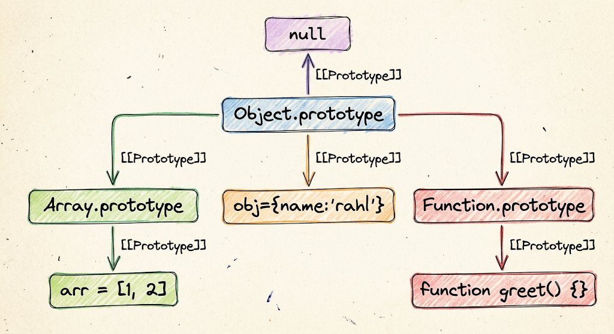
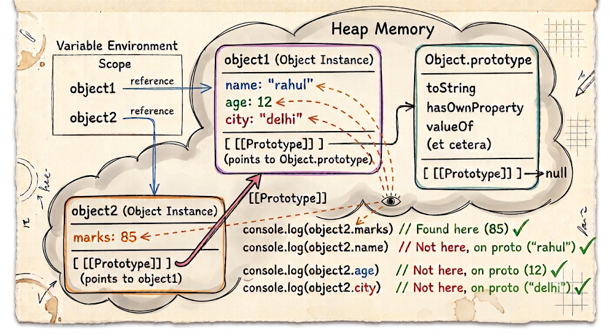

# Operator in js
------------------
- An operator is a symbol or keyword that tells JavaScript to perform a specific operation on one or more operands
- Operators can be unary, binary, or ternary depending on the number of operands they operate on.”
```js
let a = 10 + 20;
```
- expression = "10 + 20" (Expression produce a value)
- Example :<>
```js
10 + 20
x > 10
user?.name
condition ? "yes" : "no"
```
- operand = "10,20"
- operator = "+"    


# Types :
----------

## 1. Arithmetic Operators 
----------------------------
- Used for mathematical operations.

| Operator | Meaning        |
| -------- | -------------- |
| `+`      | Addition       |
| `-`      | Subtraction    |
| `*`      | Multiplication |
| `/`      | Division       |
| `%`      | Remainder      |
| `**`     | Exponentiation |

- `%` : Give remainder after division
- `**`: `2 ** 3 = 2³ = 2 × 2 × 2 = 8` → `a ** b = aᵇ` → a raised to the power of b.

## 2. Assignment Operators 
---------------------------
- An operator that assigns a value or expression result to a variable.
- The basic assignment operator is =, and JavaScript also provides compound assignment operators like +=, -=, *=, /=, %=, and `=` that perform an operation and then assign the result back to the same variable.**
- Logical Assignment Operators (ES2021) = (&&=,||=,??=)

### a. How assignment works in memory
-------------------------------------
- The variable is binding with value


### b. Compound Assignment Operators
------------------------------------
- These operators combine an operation with assignment.

| Operator | Equivalent To |
| -------- | ------------- |
| `+=`     | `a = a + b`   |
| `-=`     | `a = a - b`   |
| `*=`     | `a = a * b`   |
| `/=`     | `a = a / b`   |
| `%=`     | `a = a % b`   |
| `**=`    | `a = a ** b`  |

```js
let a=1;
let b=2;
console.log(a+=b);  // a=a+b = 3
console.log(a-=b); // a=a-b = 3 - 2 = 1
console.log(a*=b); // a=a*b = 1*2 = 2 
console.log(a/=b); // a=a/b = 2/2 = 1
console.log(a%=b); // a=a%b = 1%2 = 1
console.log(a**=b); // a=a**b = 1**2 = 1^2 = 1
```

## 3. Comparison Operators
----------------------------
- Comparison operators compare values and return a boolean.
```js
>    greater than
<    less than
>=   greater than or equal
<=   less than or equal
==   loose equality
!=   loose inequality
===  strict equality
!==  strict inequality
```
- Same idea also for (!=)(loose inequality) and (!==)(strict inequality)
- `==` allows type coercion before comparison, while `===` does not perform type coercion and requires both value and type to be the same.
```js
// # Loose Equality
// # JavaScript may perform type coercion before comparing. 
console.log(5 == '5')  // (5 == '5') = JS do type coercion = (5 == 5) = true
// # Strict Equality
console.log(5 === '5') // false (js no do type coercion value is same but DT is diff)
// # Loose Inquality
console.log(5 != '5'); // (5 != '5') = (5 != 5)= false (cuase they are equal)
// # Strict Equality
console.log(5 !== '5') // true (vaue is not same)(cuase DT is different)
```
###  Note : In fact, NaN is not equal to itself:
- `NaN` stands for `Not-a-Number`. 
- In JavaScript, `NaN` is a special numeric value that `represents` an `unrepresentable or invalid or undefined numeric result`. 
- `NaN` is `never equal to itself`, so both `NaN == NaN` and `NaN === NaN` return `false`. 
- This behavior comes from the `IEEE-754 floating-point standard`. To check whether a value is NaN, we use `Number.isNaN()`.
```js
console.log(NaN == NaN);            // false
console.log(NaN === NaN);           // false
console.lopg(typeof NaN);           // number
console.log(Number.isNaN(NaN));     // true
```

## 4. Logical Operators
-------------------------
1. AND && = Both conditions must be truthy.
2. OR || = At least one conditon must be truthy.
3. ! = Flips the boolean value (!true = false)

```js
let loggedIn = false;

if (!loggedIn) {
    console.log("Please login");
}
```

- && and || used in Short-Circuiting Logic
- && returns the first falsy value; if there is no falsy value, it returns the last value.

```js
0 && 10        // 0
"" && "Hello"  // ""
null && 10     // null

10 && 20       // 20
"Hi" && 100    // 100
```
- Note : if condition internally converting truthy and falsy value to boolean to validate
```js
console.log(10 && 20)          // 20
console.log("rahul" && 20)     // 20
console.log([] && 20)          // 20
console.log({} && 20)          // 20
// # Falsy value
console.log(0 && 20)           // 0
console.log("" && 20)          // 
console.log(null && 20)        // null
console.log(undefined && 20)   // undefined
console.log(NaN && 20)         // NaN

console.log("---------------------------------------")

console.log(Boolean(10 && 20))          // true
console.log(Boolean("rahul" && 20))     // true
console.log(Boolean([] && 20))          // true
console.log(Boolean({} && 20))          // true
// # Falsy value
console.log(Boolean(0 && 20))           // false
console.log(Boolean("" && 20))          // false
console.log(Boolean(null && 20))        // false
console.log(Boolean(undefined && 20))   // false
console.log(Boolean(NaN && 20))         // false

console.log("---------------------------------------")

if(10 && 20)                    // 10 && 20 = 20 = Boolean(20) = true
{
    console.log(true)           // true 
}
```

- || returns the first truthy value; if there is no truthy value, it returns the last value.

```js
0 || 10          // 10
"" || "Hello"    // "Hello"
null || 100      // 100

10 || 20         // 10
"Hi" || "Hello"  // "Hi"

```
```js
console.log(10 || 20)          // 10
console.log("rahul" || 20)     // rahul
console.log([] || 20)          // []
console.log({} || 20)          // {}
// # Falsy value
console.log(0 || 20)           // 20
console.log("" || 20)          // 20
console.log(null || 20)        // 20
console.log(undefined || 20)   // 20
console.log(NaN || 20)         // 20

console.log("---------------------------------------")

console.log(Boolean(10 || 20))          // true
console.log(Boolean("rahul" || 20))     // true
console.log(Boolean([] || 20))          // true
console.log(Boolean({} || 20))          // true
// # Falsy value
console.log(Boolean(0 || 20))           // true
console.log(Boolean("" || 20))          // true
console.log(Boolean(null || 20))        // true
console.log(Boolean(undefined || 20))   // true
console.log(Boolean(NaN || 20))         // true
```
- Logical Not `!`
```js
console.log(!10);        // !Boolean(10) = !true = false
console.log(!"rahul");   // !Boolean("rahul") = !true = false
console.log(![]);        // !Boolean([]) = !true = false
console.log(!{});        // !Boolean({}}) = !true = false           
console.log(!0);         // !Boolean(0) = !false = true
console.log(!"");        // !Boolean("") = !false = true
console.log(!null);      // !Boolean(null) = !false = true
console.log(!undefined); // !Boolean(undefined) = !false = true
console.log(!NaN);       // !Boolean(NaN) = !false = true
```

## 5. Nullish Coalescing ??
---------------------------
- This operator is similar to ||, but importantly different
- left ?? right = returns the right side only when the left side is:null/undefined

```js
let username = null/undefined;
console.log(username ?? "Guest")  // Guest


let username = "";
console.log(username ?? "Guest") // ""
console.log(username || "Guest")// Guest 
```
- Note :
- || = "Give me a fallback if the value is falsy (false)"
- ?? = "Give me a fallback only if the value is missing(nullish value)(null/undefined)"

```js
console.log(null || "Guest");
console.log(undefined || "Guest");
console.log("" || "Guest");
console.log("----------------------")
console.log(null ?? "Guest");
console.log(undefined ?? "Guest");
console.log("" ?? "Guest");

// Case 1 : if age is 0, then always 18 will assign but in real life age=0 is possible
const age = 0;
const userAge = age || 18; // not valid used of || cause age with zero is valid value
console.log(userAge); // 18 ❌ 

// Solution : used ??
const userAge = age ?? 18;
console.log(userAge); // 0 ✅

// Case 2 : volume=0
const volume = 0;
const finalVolume = volume || 50;
console.log(finalVolume); // 50 ❌ // not valid used of || cause volume with zero is valid value

// Solution : used ??
const finalVolume = volume ?? 50;
console.log(finalVolume); // 0 ✅
```

## 6. Unary Operators
--------------------
- A operator that performs an operation on a single operand is called UO.
- Ex: ~,!,+,-,++,--,typeof,delete,void
- For example, in typeof x, typeof is the unary operator and x is its single operand.

### 1. Unary `+`
----------------
- this operator used to convert value into number. 
- The unary + operator performs `numeric coercion`. For objects, JavaScript first tries to convert the object into a primitive value, and then converts that primitive to a number.

```js
Non-Primitive
  ↓
ToPrimitive
  ↓
Primitive value
  ↓
ToNumber
  ↓
Number / NaN

// # Object
+{} = js need primitive value so convert = String({}) = "[object Object]" (Primitive Value) = Number("[object Object]") = NaN
+{} = Number(String({})) = Number("[object Object]") = NaN
//- {} → memory address → convert address to number → NaN (than why array give 0 for that read below)

// # Array
// - Arrays have special string conversion behavior.
// String([]) = ""
// String([1, 2, 3]) = 1,2,3
// String([10]) = 10

+[] = js need primitive value so convert = String([]) = "" (Primitive Value) = Number("") = 0
+[] = Number(String([])) = Number("") = 0
```
- String and Array relations

```js
ARRAY → STRING
String(arr)
arr.toString()
arr.join(",")

STRING → ARRAY
str.split(",")
```

```js
console.log([].join())
console.log(Number([].join()))
console.log([10,20,30].join())
console.log([10,20,30,40].toString())
console.log(typeof [10,20,30].join())

console.log(String([]));
console.log(String([10,20]));         // internally String call using this [10,20].toString() and this internally using [10,20].join() = 10,20
console.log(String(["hello"]));
console.log(String(["r1","r2","r3"]));
console.log(String([1,2,3,4]));
```

```js
let x=10;
console.log(+x); // 10

let x="10";
console.log(+x); // "10" into number output : 10

let x="10";
console.log(typeof x) // string
console.log(typeof +x) // number
```
- EX :
```js
+"10"      // 10
+"5.5"     // 5.5
+true      // 1
+false     // 0
+null      // 0
+""        // 0
```
- If conversion isn't possible: it will return "NaN"
```js
+"hello" // NaN
+"true" // NaN
```
- JavaScript `ignores leading/trailing whitespace` during `numeric conversion`.
- Array toString() uses join(), and join() treats null/undefined array elements as an empty string.
```js
console.log(+" ");  // Number(" ") = 0

Number(true)        // 1
Number("")          // 0
Number(" ")         // "  "= "" = 0
Number(false)       // 0
Number(null)        // 0
Number(undefined)   // NaN
String([null/undefined])     // ""(empty string) = cuase String internally using join() method
[NaN].join() // "NaN"
```

### 2. Unary `-`
------------------
- Same as `+` just after nunber it will negate that number.

```js
// # Primitive value
console.log(-"10");        // -10
console.log(-"");          // -0
console.log(-" ");         // -0
console.log(-true);        // -1
console.log(-false);       // -0
console.log(-null);        // -0
console.log(-undefined);   // NaN

// # Non - Primitive
console.log(-[]);          // -0
console.log(-[10]);        // -10
console.log(-[10, 20]);    // NaN
console.log(-{});          // NaN
console.log(-[null]);      // -0
console.log(-[undefined]); // -0

```

### 3. Increment `++` (Same rule as 4. Decrement `--`)
--------------------------------------------------------
- The `++` operator increases a value by 1.
```js
let x=1;
x++
console.log(x); // 2
++x;
console.log(x); // 3
```
- Pre-increment : first increment than assigne 
```js
let x=1;
let y=++x;
console.log(x) // 2
console.log(y) // 2
```
- Post-increment : first assign than increment 
```js
let x=1;
let y= x++;
console.log(x) // 2
console.log(y) // 1
```
####  Note : ++ and + 
- `++` performs `numeric conversion` and `increments` the value
- `+` is special because it can mean `addition` OR `string concatenation`.
```js
let a="10";
a++;
console.log(a);         // Number("10") = 10 + 1 = 11
console.log("10" + 1)   // "101"
```


### 4. Logical NOT `!`
----------------------
- `!` converts a value to `Boolean` and then `reverses` it.
- 0, null, undefined, "", NaN, and false are falsy.
```js
!true       // false
!"hello"    // false
!0          // true
!null       // true
!undefined  // true
!""         // true 
!NaN        // true 
!false      // true
```

### 5. Double NOT `!!`
----------------------
- `!!` is technically two unary ! operations.
- It is commonly used to convert a `value into a Boolean`.
- `!!` is used to `explicitly` convert a value into a Boolean when I need a reliable true or false value
```js
!!true       // true
!!"hello"    // true
!!0          // false
!!null       // false
!!undefined  // false
!!""         // false 
!!NaN        // false 
!!false      // false
```
- `When to use !! in application` ?
1. Use !! when you need to convert any value into a Boolean (true / false).
2. Commonly used for checking existence of values like tokens, API data, optional properties, or config values.
3. Don't use it when the value is already a Boolean.


### 6. `typeof`
----------------
- return type of value
```js
console.log(typeof "rahul");    // "string"
console.log(typeof true);       // "boolean"
console.log(typeof false);      // "boolean"
console.log(typeof 10);         // "number"
console.log(typeof 10.5);       // "number"
console.log(typeof 0);          // "number"
console.log(typeof 1);          // "number"
console.log(typeof "");         // "string"
console.log(typeof null);       // "object" (That's a historical JavaScript behavior.)
console.log(typeof undefined);  // "undefined"
console.log(typeof NaN);        // "number"
```

### 7. `delete`
-----------------
- used to remove property in object
```js
const user={
    name:"rahul",
    age : 21
}
console.log(user) // { name: 'rahul', age: 21 }
delete user?.age; // delete is operator and user?.age is operands
console.log(user) // { name: 'rahul' }
```

### 8. `void`
--------------
- `void` evaluates an expression and `returns undefined`.
- It's `rarely` needed in everyday application code, but it can be used when I intentionally want to ignore a return value or in some JavaScript expression patterns.
```js
console.log(void 10) // undefined
```
- Uses :
```js
<a href="javascript:void(0)">Click</a>

void function () {
    console.log("Hello");
}();
```

### 9. Bitwise NOT `~`
-----------------------
- `~` is a unary bitwise operator.
- It performs bitwise NOT on the number.
- ~ works on the 32-bit integer representation of a number and flips its bits.
- Formula : `~x = -(x + 1)`


## 7. Bitwise Operators
------------------------
- Bitwise operators work on the binary representation of integers.
- JavaScript Number is normally a 64-bit floating-point value, but when you use a bitwise operator, JavaScript converts the value to a 32-bit signed integer, performs the operation, and converts the result back to a Number.

| Operator | Name                 | Purpose                         |                 
| -------- | -------------------- | ------------------------------- |
| `&`      | Bitwise AND          | Check/combine bits              |                  
| `|`      | Bitwise OR           | Set/combine bits                |
| `^`      | Bitwise XOR          | Toggle/detect different bits    |                  
| `~`      | Bitwise NOT          | Flip every bit                  |                  
| `<<`     | Left Shift           | Shift bits left                 |    
| `>>`     | Signed Right Shift   | Shift bits right                |                  
| `>>>`    | Unsigned Right Shift | Shift bits right with zero-fill | 

```js
console.log(5 & 3) // 1
console.log(5 | 3) // 7
console.log(5 ^ 3) // 6
console.log(~5) // -6
console.log(~3) // -4
console.log(5 << 1); // 10 (Shift the bits of 5 to the left by 1 positions.)
console.log(5 << 2); // 20
console.log(5 >> 1); // 2  (Shift the bits of 5 to the right by 1 positions.)
console.log(-5 >> 1) // -3
```


## 8. Ternary Operator `(?:)`
------------------------------
- The operator which is used 3 operands to perform operation is called TO (?:)
- The ternary operator is a compact conditional expression.
```js
let result;

if (age >= 18) {
    result = "Adult";
} else {
    result = "Minor";
}

// # Using TO
console.log(age>=18 ? "Adult" : "Minor")
```
```js
{isLoggedIn ? <Dashboard /> : <Login />}
```

## 9. Optional Chaining `?.`
------------------------------
- modern js feature
- Try to access this. If the value before ?. is `null or undefined`, `stop` and `return undefined` instead of `throwing an error`.
- Allows you to `safely access a property, method, or element` when something might be null or undefined.
- ?. checks only nullish values (null/undefined)
```js
// # Old Pattern
if(user && user.profile && user.profile.name) {}
// # Latest Pattern
if(user?.profile?.name) {}
```
```js
const user={}
console.log(user.profiles.name); // throw error and below action will not executed applicatio down
console.log("next action of application")
// Output : TypeError
// console.log(user.profiles.name);
//                           ^
// TypeError: Cannot read properties of undefined (reading 'name')
```
- Solution
```js
const user={}
console.log(user.profiles?.name); // return undefined instead error and execute the below action
console.log("next action of application") 
```
### a. Optinal Property Access
-------------------------------
```js
const user={
    name:"rahul"
}
console.log(user?.name)
```

```js
const user=null // or undefined
console.log(user.name)    // TypeError: Cannot read properties of undefined (reading 'name')
```

### b. Optional Function Call 
------------------------------
- If login exists and is callable, call it. Otherwise return undefined.
```js
const user = null;
user?.login?.(); // null?.login?.() = undefined
```

```js
const user={
    login(){
        console.log("Please login")
    },
    logout(){
        console.log("Please logout")
    }
}

console.log(user.login)
console.log(typeof user.login)
console.log(user?.login?.())

// # Output :
// [Function: login]
// function
// Please login
// undefined
```

### c. Optional Array Access
------------------------------
- Useful when an array may not exist.
```js
const user = [ { name: "Rahul" }];
console.log(user?.[0]?.name);
```

```js
const user=null //undefined
console.log(user?.[0]) // undefined
```

### d. Optional Chaining
--------------------------
- The chain stops when it encounters null or undefined.
- You can chain it : `user?.profile?.address?.city`
- `Syntax : object?.property`
```js
const user = {
    profile: null
};
console.log(user?.profile?.name); // undefined
```

### e. Nullish Coalescing `??` + Optional Chaining `?.`
------------------------------------------------------
- we can use this two together 
- Use 1 :
```js
const user = null;
const name = user?.name ?? "Guest";
console.log(name);  // "Guest"
```
- Use 2 : if name is empty string (but ?? is only work on nullish value) (null/undefined) so defulat name not applied see used 3
```js
const user = {
    name: ""
};
const name = user?.name ?? "Guest";
console.log(name);  // ""
```

- Use 3 :  || treats "" as falsy.
```js
const user = {
    name: ""
};
const name = user?.name || "Guest";
console.log(name);  // "Guest"
```
####  Note : (OC)(?.) + (NO)(??) + (LOR)(||)  = this 3 combination is better to used

- OC (`?.`)
→  Use when a property/method may be `null` or `undefined`.
→  Safely access nested data without throwing an error.

- NO (`??`)
→ Use when you want a default value only when the value is null or undefined

- LOR (`||`)
→ Use when you want a fallback for any falsy value.
→ Falsy values include 0, false, "", null, undefined, and NaN.


## 10. `in` Operator
--------------------
- Used to check whether a property/key exists inside an object.
- returning boolean value
- Property name should be symbol(variable) or string.
- Syntax : `property in object`
```js
const user = {
    name: "Rahul",
    age: 23
};

console.log("name" in user)  // true
console.log("email" in user) // false
console.log("toString" in user) // true because inherited properties can count.
```
### a. Auto Number convertion
------------------------------
- You don't need to manually convert numbers to strings in common cases because property keys are coerced appropriately:
```js
const obj = {
  10: "hello"
};

console.log(10 in obj);    // true
console.log("10" in obj);  // true
```
### b. With inherited properties
---------------------------------
- in works with inherited properties too
```js
const user = {
  name: "Rahul"
};
console.log("name" in user); // true
console.log("toString" in user); // true  Why ?
// Because JavaScript objects have a prototype chain.

// user
//  ↓
// Object.prototype
//  ↓
// null

// toString exists on Object.prototype.
```
### c. How to check property relation wity object 
--------------------------------------------------
- You can check only own properties using : `Object.hasOwn(obj,property)` =  check is this property owned by this object = Return Boolean Value
```js
console.log(Object.hasOwn(user, "name"));   // true
console.log(Object.hasOwn(user, "toString"));   // false
```

### d. `in` with arrays
------------------------
- Also work wity arrays, because `array indexes` are actually `property keys`.
- `0 in arr` : "Does property 0 exist in this array?"

```js
# Conceptually : ["a","b","c"]
# Internally has properties like :
"0" → "a"
"1" → "b"
"2" → "c"
"length" → 3
```

```js
const arr = ["a", "b", "c"];

console.log(0 in arr); // true
console.log(1 in arr); // true
console.log(2 in arr); // true
console.log(3 in arr); // false
```
- `in` does `NOT` check `array values`
```js
const arr = ["apple", "banana", "mango"];
console.log("apple" in arr);                 // false => Because "apple" is a value, not an index/property.
console.log(arr.includes("apple"));          // true
```

### e. With Sparse & Dense Arrays 
----------------------------------
- `Dense Array` or `Packed Array` => A dense array `has an element` at every index from `0 to length - 1`.
```js
const arr = [10, 20, 30, 40]; // There are no missing indexes
```

- A `Sparse Array` has `one or more missing indexes (with empty item)` (empty ≠ undefined).

```js
// # How to create a sparse array
const arr = new Array(5);
console.log(arr);       // [ <5 empty items> ]
console.log(arr.length) // 5
```

```js
const arr = [];   // or arr [10,,,40]
arr[0] = 10;
arr[3] = 40;
console.log(arr);           // [ 10, <2 empty items>, 40 ]
console.log(arr.length);    // 4
// # Conceptually 
// 0 → 10
// 1 → empty
// 2 → empty
// 3 → 40
```

```js
const arr = [];
arr[2] = "hello";
console.log(arr);       // [ <2 empty items>, 'hello' ] => index 0,1 is not exist also in object
console.log(0 in arr);  // false => index or property 0,1 is not exist
console.log(1 in arr);  // false
console.log(2 in arr);  // true
```

```js
const a = [];   
a[2] = 10;                             // SA
const b = [undefined, undefined, 10];  // DA
console.log(0 in a);                   // false
console.log(0 in b);                   // true => Cause Here indexes 0 and 1 exist, and their values are undefined.
```
### f. in with null and undefined
----------------------------------
- The right-hand side must be an object.
```js
console.log("name" in null)         // TypeError: Cannot use 'in' operator to search for 'name' in null
console.log("name" in undefined)    // TypeError: Cannot use 'in' operator to search for 'name' in undefined
console.log("name" in "rahul")      // TypeError: Cannot use 'in' operator to search for 'name' in rahul
console.log("name" in {name:"bro"}) // true
```

### g. in with functions
-------------------------
- Functions are objects in JavaScript, so in works with them.(this function object store in heap)
```js
const greet = function hello(){}
console.log(greet)            // [Function: sum]
console.log(typeof greet)     // function
```
- Internal structure
Execution Context / Environment

```text
┌──────────────────┐
│ greet ───────────┼──────────────┐
└──────────────────┘              │
                                  ▼
                              Heap
                         ┌─────────────────┐
                         │ Function Object │
                         │                 │
                         │ name: "hello"   │
                         │ code: () => {}  │
                         │ prototype: ...  │
                         └─────────────────┘
```

### a. name 
-------------
- If a function expression has a name, .name uses that name. If it doesn't, JavaScript can infer the name from the surrounding assignment
```js
function add(){}
console.log(add.name) // add 
```
- So JavaScript infers the function's name from the variable :

```js
const greet = function(){}
console.log(greet.name) // greet
```

```text
greet
  │
  │ reference
  ▼
┌─────────────────────┐
│ Function Object     │
│ name: "greet"       │
│ code: function() {} │
└─────────────────────┘
       Heap
```

### b. length 
--------------
- length tells you the number of parameters expected by the function.

```js
function add(a, b) { return a + b; }
console.log(add.length); // 2
```

- length counts parameters before the first default parameter,excluding rest parameters.
```js
function test(a,d,b=20,c){}
console.log(test.length) // 2

function test(a,b,...c){}
console.log(test.length) // 2
```

### c. prototype 
-----------------
- In JavaScript, a prototype is an `internal object` `from` which other objects `inherit` `properties and methods`.Instead of using traditional class-based inheritance like Java or C++, JavaScript uses a prototype-based inheritance model, meaning objects can act as direct blueprints for other objects

#### a.Prototype with Array,Object & Function
----------------------------------------------

```js
// # `.prototype` Return the shared object so that other object use their shared method 
console.log(Array.prototype)     // Arr.Prototype
console.log(Function.prototype)  // Function.Prototype
console.log(Object.prototype)    // Object.Prototype


// # `.__proto__` retunr parent object, the child object arr is inheriting the shared propery/method of Array.prototype object
// # __proto__ is an accessor property available through Object.prototype that allows you to get/set the [[Prototype]] of an object.
// # __proto__ is a way to access that internal [[Prototype]] relationship.
// # __proto__ allows us to access the [[Prototype]] of an object.

// # Mental modal
// arr
//  │
//  │ [[Prototype]]
//  ▼
// Array.prototype

let arr=[1,2];
console.log(arr.__proto__)      // Arr.Prototype => Give me the [[Prototype]] of arr. = Array.prototype
console.log(Array.prototype)    // Arr.Prototype
console.log(arr.__proto__ === Array.prototype) // true
console.log(arr.__proto__.__proto__)            // (Array.prototype).__proto__ = Object.prototype 
console.log(Array.prototype.__proto__)          // Array.prototype.__proto__ = Object.prototype  
console.log(Object.prototype)                   // Object.prototype 
console.log(arr.__proto__.__proto__ === Array.prototype.__proto__ === Object.prototype) // false cause === not support chaining
console.log((arr.__proto__.__proto__ === Array.prototype.__proto__) === Object.prototype) // false  => (true) === Object.prototype 
console.log(arr.__proto__.__proto__ === Object.prototype);      // true
console.log(Array.prototype.__proto__ === Object.prototype);    // true
// # So : arr.__proto__.__proto__ === Array.prototype.__proto__ === Object.prototype
console.log(arr.__proto__.__proto__.__proto__)    // Array.prototype.__proto__.__proto__ = Object.prototype.__proto__ = null
console.log(Array.prototype.__proto__.__proto__)  //  Object.prototype.__proto__ = null
console.log(Object.prototype.__proto__);          // null


// # Function
function greet(){}
console.log(greet.__proto__)      // Function.prototype                  
console.log(Function.prototype)   //  Function.prototype
console.log(greet.__proto__ === Function.prototype) // true
console.log(greet.__proto__.__proto__ === Object.prototype)   // true
console.log(greet.__proto__.__proto__.__proto__)    // null
console.log(Object.prototype.__proto__) // null
```


#### b. Prototype chaining 
----------------------------
- Prototype chaining is the mechanism in JavaScript where, if a property or method is not found on an object, JavaScript looks for it in that object's prototype, and continues searching up the prototype chain until it finds the property or reaches null.
- How Prototype Chain Works
    1. Check the object itself.
    2. If found → return it.
    3. If not found → go to its [[Prototype]].
    4. Keep searching up the chain.
    5. If it reaches null → return undefined.


#### c. get/set __proto__
--------------------------
- It is an accessor inherited from Object.prototype that lets you get/set an object's internal [[Prototype]]
- Every ordinary JavaScript object has an internal [[Prototype]] link. __proto__ is a legacy accessor that exposes that link.

```js
const object1 = {
    name: "rahul",
    city: "delhi",
    age: 12
};
```

```text
object1
   │
   │ reference
   ▼
┌──────────────────────┐
│ Object               │
│                      │
│ name → "rahul"       │
│ city → "delhi"       │
│ age  → 12            │
│                      │
│ [[Prototype]] ───────┼──────────┐
└──────────────────────┘          │
                                  ▼
                           Object.prototype
                           ┌──────────────────┐
                           │ toString         │
                           │ hasOwnProperty   │
                           │ valueOf          │
                           │ [[Prototype]]    │
                           └────────┬─────────┘
                                    │
                                    ▼
                                  null
```

```js
const object1={
    name:"rahul",
    age:12,
    city:'delhi'
}

const object2={marks:85}

object2.__proto__ = object1

console.log(object2.marks)  // 85
console.log(object2.name)   // rahul
console.log(object2.age)    // 12
console.log(object2.city)   // delhi
```



#### d. Object.getPrototypeOf(arr/obj/function)
--------------------------------------------------
- Better to use `Object.getPrototypeOf(arr/obj/function)` instead `__proto__` to get [[prototype]] (parent prototype link)
```js
let arr=[1]
console.log(Object.getPrototypeOf(arr))  // Array.prototype

let object1={name:"ra"}
console.log(Object.getPrototypeOf(object1)) // Object.prototype
console.log(Object.getPrototypeOf(Object.getPrototypeOf(object1))) // null

function greed(){}
console.log(Object.getPrototypeOf(greed)) // Function.prototype
```

#### e. set Object.create()
-------------------------------
- Object.create() `creates a new object` and `sets` the given object as `its prototype`.
```js
const person = {
  greet() {
    console.log("Hello");
  }
};
const user = Object.create(person);   // user.__proto__ = person
console.log(user.greet()); // Helle undefined
// user
//   ↓
// person
//   ↓
// Object.prototype
//   ↓
// null
```

```js
const obj = Object.create(null);
obj.name = "Rahul";
console.log("name" in obj); // true
console.log("toString"/"hasOwnProperty/"valueOf" in obj); // false,Cause we set the [[prototype]] link null for obj
```

### d. in with nested objects
------------------------------
```js
const user = {
  profile: {
    name: "Rahul"
  }
};
console.log("profile" in user); // true
console.log("name" in user); // false
console.log("name" in user.profile); // true
```

### e. in vs Object.hasOwn()
---------------------------
- property `in` object = `check own + inherited properties`
-  Object.hasOwn(object, property) = own properties only

```js
const person={ age:50 }
const user=Object.create(person)
user.name ="deepak"
console.log("name" in user) // true
console.log("age"  in user) // true 
console.log(Object.hasOwn(user,"name")) // true
console.log(Object.hasOwn(user,"age"))  // false, Because age belongs to the prototype.
```
### f. in operator vs optional chaining
---------------------------------------
- `in`      → check property existence
- `?.`      → safe property access
```js
const user=null;
console.log(user?.name); // undefined
console.log("name" in user); // TypeError: Cannot use 'in' operator to search for 'name' in null
```

### Note :
------------
- The in operator checks whether a property exists on an object or anywhere in its prototype chain. It returns a boolean.
- "toString" (inheritence)
- Object.hasOwn(obj,property)
- `includes()` → value existence
- Sparse array → missing property/index
- Dense array → every index exists
- Prototype in Array,Object & Function => [[Prototype]] => Prototype Chaining

```js
let user = { name: "rahul" };

console.log(user.__proto__);   // Object.prototype
console.log(Object.prototype); // Object.prototype
console.log(user.prototype);   // undefined
```
| Expression         | Meaning                                       |
| ------------------ | --------------------------------------------- |
| `user.__proto__`   | Gets the object's `[[Prototype]]`             |
| `Object.prototype` | The prototype object of normal objects        |
| `user.prototype`   | Looks for a normal property named `prototype` |
| `undefined`        | Property doesn't exist                        |

```js
user
┌─────────────────────┐
│ name: "rahul"       │
│                     │
│ [[Prototype]] ───────────────► Object.prototype
│                     │
│ prototype: ❌       │
└─────────────────────┘
```

```js
__proto__  → "Who is my prototype?"
prototype  → "What prototype will my created objects use?"
```

## 11. `instanceof` Operator
-----------------------------
- Checks whether an object is associated with a constructor's prototype chain.
- It is commonly used when you need to distinguish object instances.
- return Boolean value
```js
const arr = [];
arr instanceof Array    // true

const date = new Date();
date instanceof Date    // true
```
- `object instanceof Constructor` checks whether `Constructor.prototype` exists somewhere in object's prototype chain.
```js
const arr = [];
console.log(arr instanceof Array);  // true
// # "Is Array.prototype somewhere in arr's prototype chain?"
```

```js
// value instanceof prototype
// # LEFT operand  → can be primitive or object(non-primitive)
// RIGHT operand → normally must be a constructor/function
```

- Primitive values normally don't have a prototype chain 
```js
let user = 0   // null/undefined/""/NaN/0/12
console.log(user instanceof Number)  // Object/Array => false
```

- Chain
```js
arr
 │
 ▼
Array.prototype
 │
 ▼
Object.prototype
 │
 ▼
null
```
### a. Understanding With Constructor Functions
-------------------------------------------------
```js
function Person(name) {
    this.name = name;
}
```
- Memory structure 
```js
                         STACK
                ┌───────────────────┐
                │ Execution Context  │
                │                   │
                │ Person ───────────────┐
                └───────────────────┘  │
                                       │
                                       ▼

                         HEAP

                 ┌──────────────────────┐
                 │   Person Function    │
                 │                      │
                 │ name: "Person"       │
                 │ length: 1            │
                 │                      │
                 │ prototype ───────────────┐
                 │                          │
                 │ [[Prototype]] ──────┐   │
                 └──────────────────────┘   │
                                          │ │
                           ┌──────────────┘ │
                           │                │
                           ▼                ▼
                  Function.prototype   Person.prototype
                  ┌───────────────┐    ┌─────────────────┐
                  │ ...           │    │ constructor ───────► Person
                  └───────┬───────┘    └─────────────────┘
                          │
                          ▼
                    Object.prototype
                          │
                          ▼
                         null
```

```js
const rahul = new Person("rahul");
```
- Memory structure
```js
                 STACK
        ┌────────────────────┐
        │ rahul ────────────────┐
        └────────────────────┘ │
                               │
                               ▼
                         HEAP
                   ┌─────────────────┐
                   │ name: "rahul"   │
                   │                 │
                   │ [[Prototype]] ──────┐
                   └─────────────────┘   │
                                         │
                                         ▼
                                  Person.prototype
                                  ┌────────────────┐
                                  │ constructor ──────► Person
                                  └────────────────┘
```

```js
function Person(name)
{
    this.name=name 
}
console.log(Person)             // [Function: Person]
console.log(Person.__proto__)   // [Function (anonymous)] Object
console.log(Person.prototype)   // {}
// # JavaScript creates an object whose prototype points to Person.prototype
const rahul=new Person("rahul") 
console.log(rahul);             // Person { name: 'rahul' }
console.log(rahul.__proto__)    // {}
console.log(rahul.prototype)    // undefined
```
```js
function Person() {}
const rahul = new Person();
console.log(rahul instanceof Person);   // true
console.log(rahul instanceof Object);   // true
```

### b.Array Example
-------------------
```js
const numbers = [10, 20, 30];
console.log(numbers instanceof Array);  // true
console.log(numbers instanceof Object); // true
```

### c. instanceof With Primitive Values
---------------------------------------
- `instanceof` checks the `prototype-chain relationship`.
```js
console.log(10 instanceof Number);      // false (is not an object so that searching is happen in prototype chain)
console.log("hello" instanceof String); // false
console.log(true instanceof Boolean);   // false
```
- But wrapper objects behave differently:
```js
const num = new Number(10);
console.log(num instanceof Number); // true
```

```js
// # Non - Primitive Value
let a={name:"sdf"};
console.log(a.__proto__)    //  Object.prototype
console.log(a.prototype)    // undefined (not found this key in object)

// # Primitive Value
let b =10;
// # So primitive 10 doesn't itself have [[Prototype]]; JavaScript temporarily boxes it when accessing .__proto__.
console.log(b.__proto__)    // {} in node and Number.prototype in browser
console.log(b.__proto__.__proto__) // Object.prototype
console.log(b.prototype)    // undefined (not found this key in object)
```
### d. instanceof internal code 
--------------------------------
```js
// # Issue: Using __proto__ is legacy behavior (deprecated in ES6). 
// # More importantly, objects created with Object.create(null) do not have __proto__ inherited from Object.prototype, 
//   which can cause issues or unexpected behavior.
// # Standard approach: Use Object.getPrototypeOf(obj).

function instanceOf(obj,target){
    if(obj === null || obj === undefined) return false;
    let objPrototype = Object.getPrototypeOf(obj);

    while (objPrototype !== null) {
        if (objPrototype === target.prototype) {
            return true;
        }
        objPrototype = Object.getPrototypeOf(objPrototype);
    }
    return false
}
console.log(instanceOf(1,Number))   // true
```

## 12. `new` Operator 
-----------------------
- new is an operator used to create an object from a constructor.
```js
const user = new User();
const date = new Date();
```

## 13. Spread Operator `...`
----------------------------
### a. With Array
-----------------

### b. With Object
------------------

## 14. Rest Operator `...`
--------------------------
### a. With Array
-----------------

### b. With Object
------------------